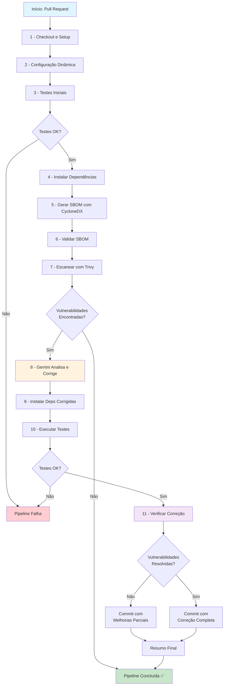

# Pipeline de Segurança DevSecOps com GenAI

## 1. Visão Geral

Este projeto implementa uma pipeline de CI/CD (Integração Contínua/Entrega Contínua) com foco em segurança (DevSecOps) para aplicações Python. O objetivo principal é automatizar a detecção e a remediação de vulnerabilidades em dependências de software (ataques de cadeia de suprimentos), utilizando uma abordagem moderna que inclui a geração de SBOM (Software Bill of Materials), escaneamento de vulnerabilidades com Trivy e correção automática com o auxílio de Inteligência Artificial Generativa (Google Gemini).

A pipeline foi projetada para ser robusta, agindo como um portão de qualidade e segurança antes que o código seja integrado à branch principal.

## 2. Arquitetura e Funcionamento da Pipeline

O workflow é orquestrado pelo GitHub Actions e está definido em `.github/workflows/security_remediation.yml`. Ele é acionado a cada `pull request` enviado para a branch `main`.

### Fluxo do Workflow



### Detalhamento dos Passos

#### **1. Checkout e Setup do Ambiente**
- **Ação:** `actions/checkout@v4` e `actions/setup-python@v5`
- **Descrição:** O código da branch do PR é baixado e a versão do Python (definida em `ci_config.yml`) é configurada
- **Novidade:** Usa `fetch-depth: 0` para ter histórico completo e permite commits de volta ao PR

#### **2. Configuração Dinâmica**
- **Comando:** `yq` para ler `ci_config.yml`
- **Descrição:** Lê dinamicamente a configuração do projeto (versão Python, arquivos de requirements) em vez de valores hardcoded

#### **3. Testes Iniciais**
- **Comando:** `pytest tests/`
- **Descrição:** Executa testes *antes* de qualquer análise para garantir que o código base está funcional

#### **4. Instalação de Dependências**
- **Comandos:** `pip install -r requirements.txt` + `cyclonedx-bom`
- **Descrição:** Instala dependências do projeto e ferramentas necessárias para geração de SBOM

#### **5. Geração do SBOM**
- **Comando:** `cyclonedx-py requirements -i requirements.txt -o cyclonedx.json`
- **Descrição:** Gera SBOM no formato CycloneDX diretamente do requirements.txt

#### **6. Validação do SBOM**
- **Ferramenta:** `cyclonedx-cli validate`
- **Descrição:** Valida se o SBOM gerado está em conformidade com o padrão CycloneDX

#### **7. Escaneamento com Trivy**
- **Comando:** `trivy sbom cyclonedx.json`
- **Descrição:** Escaneia o SBOM em busca de vulnerabilidades conhecidas (CVEs)
- **Saídas:** `trivy-results.json` (processamento) + formato tabela (visualização)

#### **8. Correção Inteligente com Gemini** ⭐
- **Funcionamento:**
  1. **Análise Dinâmica:** Processa *todas* as vulnerabilidades encontradas pelo Trivy
  2. **Agrupamento:** Agrupa vulnerabilidades por pacote para evitar múltiplas atualizações
  3. **Prompt Contextual:** Envia para o Gemini informações detalhadas sobre cada vulnerabilidade:
     - CVE IDs e severidade
     - Versão atual instalada
     - Versões corrigidas sugeridas pelo Trivy
     - Compatibilidade com Python 3.10
  4. **Atualização Automática:** Modifica o `requirements.txt` com as sugestões do Gemini

#### **9. Instalação das Dependências Corrigidas**
- **Descrição:** Instala as novas versões exatamente como sugeridas pelo Gemini
- **Fallback:** Se falhar, restaura o arquivo original e falha o step para revisão manual

#### **10. Testes Pós-Correção**
- **Comando:** `pytest tests/`
- **Descrição:** Verifica se as atualizações não quebraram a funcionalidade

#### **11. Verificação da Correção**
- **Processo:**
  1. Gera novo SBOM com as dependências atualizadas
  2. Executa novo scan com Trivy
  3. Compara vulnerabilidades originais vs. restantes
  4. Calcula taxa de sucesso da correção

#### **12. Commit Automático**
- **Condição:** Apenas se testes passaram e correções foram aplicadas
- **Commit:** Diretamente na branch do PR com mensagem descritiva incluindo todas as CVEs corrigidas

#### **13. Resumo e Notificação**
- **Logs Detalhados:** Mostra estatísticas completas da correção
- **Arquivo de Resumo:** Gera `security_fix_summary.md` para download

## 3. Como Configurar e Usar

### **Estrutura do Projeto**
```
projeto/
├── .github/workflows/security_remediation.yml
├── ci_config.yml                 # Configuração da pipeline
├── app/
│   ├── requirements.txt          # Dependências de produção
│   ├── requirements_test.txt     # Dependências de teste
│   ├── main.py                   # Código da aplicação
│   └── tests/                    # Testes unitários
│       └── test_main.py
└── README.md
```

### **Configuração no GitHub**

#### **1. Secrets Necessários**
Configure em `Settings > Secrets and variables > Actions`:
- `GEMINI_API_KEY`: Sua chave de API do Google Gemini
- `GEMINI_VERSION`: (Opcional) Versão do modelo (padrão: `gemini-1.5-pro-latest`)

#### **2. Permissões do Workflow**
Em `Settings > Actions > General > Workflow permissions`:
- ✅ **Read and write permissions**
- ✅ **Allow GitHub Actions to create and approve pull requests**

#### **3. Arquivo de Configuração (`ci_config.yml`)**
```yaml
# Versão do Python a ser utilizada
python_version: '3.10'

# Lista de arquivos de dependências
requirements_files:
  - 'requirements.txt'
  - 'requirements_test.txt'
```

### **Como Usar**
1. **Abra um Pull Request** para a branch `main`
2. **A pipeline é acionada automaticamente**
3. **Se vulnerabilidades forem encontradas:**
   - O Gemini analisa e sugere correções
   - As correções são aplicadas automaticamente
   - Testes são executados para validar
   - Commit é feito na mesma branch do PR
4. **Revise as mudanças** e faça merge se tudo estiver correto

## 4. Características Avançadas

### **🧠 Inteligência Artificial**
- **Análise Contextual:** O Gemini recebe informações completas sobre cada vulnerabilidade
- **Compatibilidade:** Considera a versão do Python e dependências relacionadas
- **Correções Múltiplas:** Processa todas as vulnerabilidades em uma única execução

### **🔍 Análise Detalhada**
- **SBOM Completo:** Inventário completo de todas as dependências
- **Verificação de Correção:** Confirma que as vulnerabilidades foram realmente resolvidas
- **Estatísticas:** Taxa de sucesso, número de CVEs corrigidas, etc.

### **🛡️ Segurança**
- **Validação Dupla:** Testes antes e depois das correções
- **Fallback Inteligente:** Restaura estado original se algo falhar
- **Logs Completos:** Rastreabilidade total do processo

### **🔄 Automação Completa**
- **Zero Intervenção:** Funciona completamente automatizado
- **Commit Direto:** Aplica correções diretamente no PR
- **Mensagens Claras:** Commits descritivos com todas as CVEs corrigidas

## 5. Exemplo de Execução

```bash
# Antes (vulnerável)
pyyaml==5.3.1     # CVE-2020-14343 (CRITICAL)
requests==2.19.1  # CVE-2018-18074 (HIGH) + 3 outras

# Depois (corrigido pelo Gemini)
pyyaml>=6.0,<7.0   # ✅ Vulnerabilidade corrigida
requests>=2.32.0   # ✅ Todas as vulnerabilidades corrigidas

# Resultado: 5 vulnerabilidades corrigidas, 0 restantes (100% sucesso)
```

## 6. Monitoramento e Logs

A pipeline gera logs detalhados incluindo:
- 📊 **Estatísticas de vulnerabilidades** (antes/depois)
- 🔧 **Decisões do Gemini** (versões sugeridas)
- ✅ **Resultados de testes** (passaram/falharam)
- 📋 **Resumo final** (arquivo downloadável)

## 7. Limitações e Considerações

- **Dependência de IA:** Correções dependem da qualidade das sugestões do Gemini
- **Testes Obrigatórios:** Pipeline falha se testes não passarem após correção
- **Compatibilidade:** Focado em projetos Python com requirements.txt
- **Rate Limits:** Sujeito aos limites de API do Google Gemini

---

**🔒 Pipeline DevSecOps com IA - Mantendo seu código seguro automaticamente!**