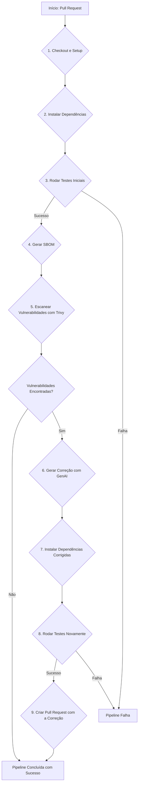

# Projeto de Pipeline de Segurança DevSecOps com GenAI

## 1. Visão Geral

Este projeto implementa uma pipeline de CI/CD (Integração Contínua/Entrega Contínua) com foco em segurança (DevSecOps) para aplicações Python. O objetivo principal é automatizar a detecção e a remediação de vulnerabilidades em dependências de software (ataques de cadeia de suprimentos), utilizando uma abordagem moderna que inclui a geração de SBOM (Software Bill of Materials), escaneamento de vulnerabilidades e correção automática com o auxílio de Inteligência Artificial Generativa (GenAI).

A pipeline foi projetada para ser robusta, agindo como um portão de qualidade e segurança antes que o código seja integrado à branch principal.

## 2. Arquitetura e Funcionamento da Pipeline

O workflow é orquestrado pelo GitHub Actions e está definido em `.github/workflows/security_remediation.yml`. Ele é acionado a cada `pull request` enviado para a branch `main`.

Abaixo estão os passos detalhados da execução:

### Fluxo do Workflow

### Detalhamento dos Passos

1.  **Checkout e Setup do Ambiente**
    *   **Ação:** `actions/checkout@v4` e `actions/setup-python@v4`.
    *   **Descrição:** O código da branch é baixado para o ambiente de execução e a versão especificada do Python (3.10) é configurada.

2.  **Instalação de Dependências**
    *   **Descrição:** As dependências de produção (`app/requirements.txt`) e de teste (`app/requirements_test.txt`) são instaladas usando `pip`.

3.  **Primeira Bateria de Testes**
    *   **Comando:** `pytest app/tests/`
    *   **Descrição:** Os testes unitários e de integração são executados para garantir que a aplicação está funcional *antes* de qualquer análise de segurança. Se os testes falharem aqui, a pipeline é interrompida imediatamente.

4.  **Geração do SBOM (Software Bill of Materials)**
    *   **Comando:** `cyclonedx-py ... -o sbom.json`
    *   **Descrição:** Um SBOM é gerado no formato CycloneDX. O SBOM é um inventário completo de todos os componentes de software e suas dependências, funcionando como uma "lista de ingredientes" da aplicação. Ele é essencial para uma análise de segurança precisa.

5.  **Escaneamento de Vulnerabilidades com Trivy**
    *   **Ação:** `aquasecurity/trivy-action@master`
    *   **Descrição:** O Trivy, uma ferramenta de escaneamento de segurança de código aberto, analisa o `sbom.json` em busca de vulnerabilidades conhecidas (CVEs) nas dependências. O resultado é salvo em `trivy-results.json`. A pipeline continua mesmo se vulnerabilidades forem encontradas para que o próximo passo possa processá-las.

6.  **Geração e Aplicação da Correção com GenAI (Placeholder)**
    *   **Descrição:** Este é o coração da automação inteligente.
        *   O script verifica se o arquivo `trivy-results.json` contém vulnerabilidades.
        *   **(Lógica a ser implementada)** Se houver, o script deve:
            1.  Analisar o JSON do Trivy para extrair as bibliotecas vulneráveis e as versões.
            2.  Construir um prompt para um modelo de GenAI (como o Gemini), enviando as informações da vulnerabilidade e pedindo uma sugestão de versão segura que corrija o problema.
            3.  Receber a resposta da API e atualizar o arquivo `app/requirements.txt` com a nova versão.
    *   **Implementação Atual (Placeholder):** No momento, o workflow usa um comando `sed` para simular essa correção, atualizando a versão do `pandas` como prova de conceito.

7.  **Reinstalação e Testes Pós-Correção**
    *   **Descrição:** Se uma correção foi aplicada pelo passo anterior, as dependências são reinstaladas com base no `requirements.txt` modificado. Em seguida, a suíte de testes é executada novamente para garantir que a atualização da dependência não introduziu quebras (breaking changes) na aplicação.

8.  **Criação de Pull Request com a Correção**
    *   **Ação:** `peter-evans/create-pull-request@v5`
    *   **Descrição:** Se os testes pós-correção passarem, um novo Pull Request é aberto automaticamente. Este PR contém as atualizações do `requirements.txt`, facilitando a revisão humana e a integração da correção de segurança.

## 3. Como Configurar e Usar

1.  **Estrutura do Repositório:** O projeto deve seguir a estrutura de pastas apresentada, com os `requirements` e testes em seus devidos locais.
2.  **Secrets do GitHub:** Para a integração com a GenAI, é necessário configurar um *secret* no repositório:
    *   `GEMINI_API_KEY`: Sua chave de API para o serviço do Google Gemini.
3.  **Permissões do Token:** A criação de Pull Requests requer que o `GITHUB_TOKEN` (fornecido automaticamente pelo GitHub Actions) tenha permissões de escrita. Isso pode ser configurado em `Settings > Actions > General > Workflow permissions`.

## 4. Próximos Passos (Roadmap)

-   [ ] **Implementar a Lógica de GenAI:** Substituir o comando `sed` por um script Python que se comunique com a API do Gemini.
-   [ ] **Melhorar o Prompt Engineering:** Refinar os prompts enviados à GenAI para obter sugestões mais precisas e considerar a compatibilidade entre pacotes.
-   [ ] **Tratamento de Falhas na Correção:** Adicionar lógica para lidar com cenários onde a correção da GenAI quebra os testes (ex: reverter a alteração e criar uma *issue* no GitHub em vez de um PR).
-   [ ] **Adicionar Notificações:** Integrar a pipeline com ferramentas como Slack ou Microsoft Teams para notificar a equipe sobre vulnerabilidades críticas encontradas e correções aplicadas.
